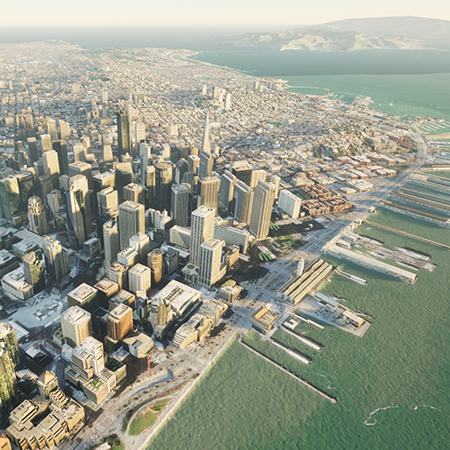
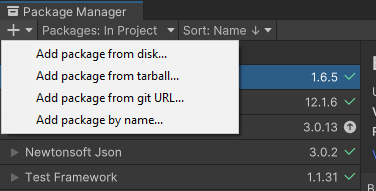

# arcgis-maps-sdk-unity-samples

Here is a Unity project containing a set of samples showing you how to accomplish various things using the combined features of Unity and the ArcGIS Maps SDK for Unity. The `main` branch is configured to work with our most recent release (1.6.0) if you want to use the sample repo with an older release check out the corresponding tag of the sample repo, `git checkout 1.0.0` for the sample repo that worked with our 1.0.0 release.

### Note

This repository is made up of two separate Unity projects. If you would like to see the samples made for regular use such as Feature Layer and Routing, please use and set up the **sample_project**. If you are interested in XR Samples such as the Virtual Reality Sample and the XR version of our Table Top Sample, please use and set up the **sample_xr**. Both projects may be used and set up simultaneously, but they do not contain the same samples.

### Requirements for Sample Project

* Computer running Windows or macOS
* The Unity project requires a minimum of Unity `2022.3.35f1`
* ArcGISMaps SDK for Unity

### Requirements for XR Sample Project

* Computer running Windows (OpenXR is not supported on macOS)
* The Unity project requires a minimum of Unity `2022.3.35f1`
* ArcGISMaps SDK for Unity
* A VR Headset and the necessary software to run through Desktop Mode

### Setting Up the XR Sample Project
Once you are ready, please open the XR Sample Project. Once open you will need to add the ArcGIS Maps SDK for Unity Plugin. You may do so through the Unity Asset Store, or from the ArcGIS Developer hub. In addition to the Maps SDK, you will also need to import the ArcGIS Maps SDK Samples. This can be found within the package manager under the ArcGIS Maps SDK Package. You will also need to import the samples for the XR Hands Package and the Samples called 'Starter Assets' and  'XR Hands Demo' from the XR Interaction Toolkit Package.

## Features
* [Building Filter](https://github.com/Esri/arcgis-maps-sdk-unity-samples/tree/main/sample_project/Assets/SampleViewer/Samples/BuildingFilter) - Explore a building scene layer by toggling the visibility of different attributes.
* [Feature service REST API](https://github.com/Esri/arcgis-maps-sdk-unity-samples/tree/main/sample_project/Assets/SampleViewer/Samples/FeatureLayer) - See how to query a feature service to create game objects in Unity located at real-world positions.
* [Geocoding](https://github.com/Esri/arcgis-maps-sdk-unity-samples/tree/main/sample_project/Assets/SampleViewer/Samples/Geocoding) - Search for an address or click on the surface to get the address of that location.
* [Geometry](https://github.com/Esri/arcgis-maps-sdk-unity-samples/tree/main/sample_project/Assets/SampleViewer/Samples/Geometry) - Draw polylines, polygons and envelopes on the map and get their lengths or areas.
* [HitTest](https://github.com/Esri/arcgis-maps-sdk-unity-samples/tree/main/sample_project/Assets/SampleViewer/Samples/HitTest) - Visualize individual Buildings ID's from a 3D Object Scene Layer.
* [Line of sight](https://github.com/Esri/arcgis-maps-sdk-unreal-engine-samples/tree/main/sample_project/Content/SampleViewer/Samples/LineOfSight) - See how to check line of sight between two objects in Unity.
* [Material By Attribute](https://github.com/Esri/arcgis-maps-sdk-unity-samples/tree/main/sample_project/Assets/SampleViewer/Samples/MaterialByAttribute) - Apply materials to 3DObject Scene layer based on specific attributes.
* [Measure](https://github.com/Esri/arcgis-maps-sdk-unity-samples/tree/main/sample_project/Assets/SampleViewer/Samples/Measure) - Click on the map to get real-world distances between points.
* [Routing](https://github.com/Esri/arcgis-maps-sdk-unity-samples/tree/main/sample_project/Assets/SampleViewer/Samples/Routing) - See how to query Esri's routing service to get the shortest path between two points and visualize that route in Unity.
* [Stream Layer](https://github.com/Esri/arcgis-maps-sdk-unity-samples/tree/main/sample_project/Assets/SampleViewer/Samples/StreamLayer) - See how to use web sockets to connect to an Esri real-time service to update game objects locations in real-time.
* [Third Person Controller](https://github.com/Esri/arcgis-maps-sdk-unity-samples/tree/main/sample_project/Assets/SampleViewer/Samples/ThirdPerson) - Explore from the perspective of a third person camera following a controllable character.
* [Real Time Weather Query](https://github.com/Esri/arcgis-maps-sdk-unity-samples/blob/main/sample_project/Assets/SampleViewer/Samples/WeatherQuery/readme.md) - Query the current weather in a city using the feature layer query work flow.

## Features in XR Sample Project

* [VRSample](https://github.com/Esri/arcgis-maps-sdk-unity-samples/tree/main/xr_sample_project//Assets/SampleViewer/Samples/VRSample) - See how to configure the camera to visualize content on a VR device and move the camera with VR locomotion.
* [XRTableTop](https://github.com/Esri/arcgis-maps-sdk-unity-samples/tree/main/xr_sample_project/Assets/SampleViewer/Samples/XRTableTop) - See how to configure the camera to visualize a tabletop map on a VR device and control the map with VR controllers and hand tracking.

## Instructions

1. Clone this repo.
2. Refer to the [ArcGIS Maps SDK for Unity's documentation on getting started](https://developers.arcgis.com/unity/get-started/) on how to download `Unity` and the `ArcGIS Maps SDK for Unity`.
3. Open the project in Unity ignoring the errors when prompted to enter `Safe Mode`.
4. Use the package manager to import the `.tarball` downloaded in step 2.

   

5. Import the samples. These samples include some components necessary for this repo to function including the `ArcGIS Camera Controller` component.

6. Launch Unity and open the `SampleViewer` level (it should open by default).

7. In the hierarchy select the `SampleSwitcher` Game Object and then in the inspector set your [API key](https://developers.arcgis.com/documentation/security-and-authentication/api-key-authentication/). For the detailed steps to create an API key, see [Create and manage an API key tutorials](https://developers.arcgis.com/documentation/security-and-authentication/api-key-authentication/tutorials/create-an-api-key/) in the _Security and authentication guide_. If you don't have the API keys page in your dashboard, upgrade your account to an [ArcGIS Location Platform account](https://location.arcgis.com/sign-up/).

8. (Optional) If you want to be able to open the `.cs` files in this project and have IntelliSense recognize variable correctly, in Unity navigate to `Edit -> Preferences -> External Tools -> Generate .csproj files for 'local tarball`

## Requirements

* Refer to the [ArcGIS Maps SDK for Unity's documentation on system requirements](https://developers.arcgis.com/unity/system-requirements/)

## Resources

* [ArcGIS Maps SDK for Unity's documentation](https://developers.arcgis.com/unity/)
* [Unity's documentation](https://docs.unity.com/)
* [Esri Community forum](https://community.esri.com/t5/arcgis-maps-sdks-for-unity-questions/bd-p/arcgis-maps-sdks-unity-questions)

## Issues

Find a bug or want to request a new feature?  Please let us know by submitting an issue.

## Contributing

Esri welcomes contributions from anyone and everyone. Please see our [guidelines for contributing](https://github.com/esri/contributing).

## Licensing

Copyright 2022 - 2024 Esri.

Licensed under the Apache License, Version 2.0 (the "License");
you may not use this file except in compliance with the License.
You may obtain a copy of the License at

   http://www.apache.org/licenses/LICENSE-2.0

Unless required by applicable law or agreed to in writing, software
distributed under the License is distributed on an "AS IS" BASIS,
WITHOUT WARRANTIES OR CONDITIONS OF ANY KIND, either express or implied.
See the License for the specific language governing permissions and
limitations under the License.

A copy of the license is available in the repository's [license.txt]( https://raw.github.com/Esri/arcgis-maps-sdk-unity-samples/master/license.txt) file.
