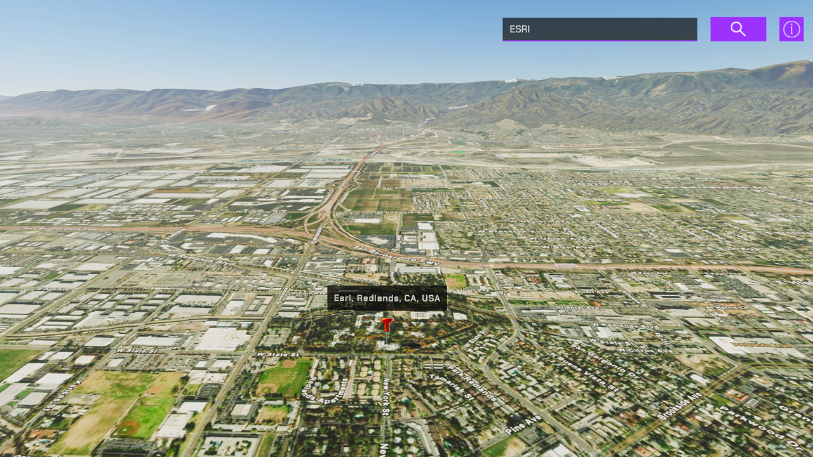

# Find places or search for an address

Find the location for an address or find the address of a selected location using the Geocoding service. 

## How to use the sample

This sample demonstrates the capability of the [Geocoding service](https://developers.arcgis.com/rest/geocode/api-reference/overview-world-geocoding-service.htm) inside Unity. You can perform two kinds of operations with this sample, find a place and find an address. 

1. Open the **Geocoding** scene.
2. Click on the **ArcGISMap** game object in the **Hierarchy** window.
3. Set your API key in the **Inspector** window.
4. Click play.
5. To find a place, put a place name or address in the search bar and press Enter. For information about the type of locations that are supported by the Geocoding service, see the [ArcGIS REST APIs documentation](https://developers.arcgis.com/rest/geocode/api-reference/geocoding-find-address-candidates.htm).
6. To find an address of a place, drop the marker to your point of interest by clicking in the viewport while holding Shift, and you will see the address displayed above the marker.

**Note:** This sample is only set up to work with a mouse and a keyboard.

## How it works

1. Have an ArcGIS Map with the mesh colliders enabled in the scene
2. Create a child game object under the ArcGIS Map and attach the geocoding script.
3. The HTTPClient is used to query the [Geocoding service](https://developers.arcgis.com/rest/geocode/api-reference/overview-world-geocoding-service.htm).
4. The [`findAddressCandidates`](https://developers.arcgis.com/rest/geocode/api-reference/geocoding-find-address-candidates.htm) operation is used for finding a place.
5. The [`reverseGeocode`](https://developers.arcgis.com/rest/geocode/api-reference/geocoding-reverse-geocode.htm) operation is used for finding an address. The marker should have the [**ArcGIS Location**](https://developers.arcgis.com/unity/maps/location-component/) component attached and its values will be used to query the address of the location.
6. Place a marker using the Location Components Surface Placement mode set to `OnTheGround` for elevation at the queried position.

## Tags
geocoding, reverse geocoding, address, locate, search
