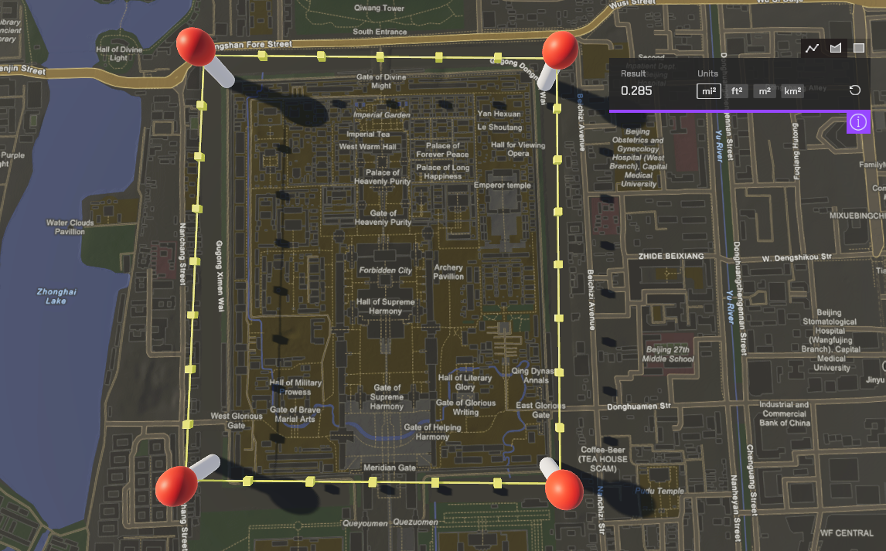

# Create polylines, polygons and envelopes (rectangles)

Draw polylines, polygons and envelopes on the map and get their lengths or areas.

## How to use the sample 

1. Open the scene.
2. Click on the **ArcGISMap** GameObject and set your API key in the **Inspector** window. 
3. Click play.
4. While holding shift, click to place points to create polylines and polygons; drag to create envelopes. Switch between tabs to switch between different types of geometries. 

## How it works

This sample uses the [geometry API](https://developers.arcgis.com/unity/api-reference/gameengine/geometry/arcgisgeometry/) for creating polygons, envelopes and calculate areas. It uses Unity's [line renderer](https://docs.unity3d.com/ScriptReference/LineRenderer.html) to create polylines, and use the geometry API to calculate distance. The distance calculated is [geodetic distance, also called geodesic distance](https://pro.arcgis.com/en/pro-app/latest/tool-reference/spatial-analyst/geodesic-versus-planar-distance.htm). The area calculated is geodetic area. You could also use the [polyline builder](https://developers.arcgis.com/unity/api-reference/gameengine/geometry/arcgispolylinebuilder/) to create polylines. But you can only get the [planar distance](https://pro.arcgis.com/en/pro-app/latest/tool-reference/spatial-analyst/geodesic-versus-planar-distance.htm) with polylines created this way. 

Note that the polyline distance calculation accounts for elevation but is an approximation. The polygon and envelope calculation don't take elevation into account.  

## About the data

Basemap is [navigation (night)](https://tiles.arcgis.com/tiles/z2tnIkrLQ2BRzr6P/arcgis/rest/services/New_York_LoD2_3D_Buildings/SceneServer/layers/0) hosted by Esri.

Elevation data is loaded from the [Terrain 3D elevation layer](https://www.arcgis.com/home/item.html?id=7029fb60158543ad845c7e1527af11e4) hosted by Esri.

## Tags

geometry engine, polygon, polyline, envelope, measure, spatial analysis
