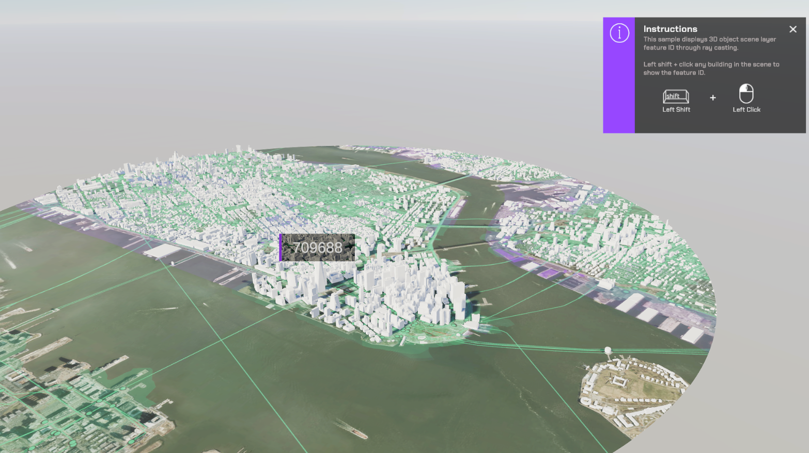

# Visualize 3DObject ID's

Get the ID for individual buildings in a scene.

## How to use the sample (SampleViewer)

1. The SampleViewer Scene should open by default, if it is not open, click the **SampleViewer** scene to open it.
2. Click play.
3. Using the UI, enter an APIKey in the input field to the top left. 
4. Open the **Samples** drop down, and click **HitTest** to open the level.
5. While holding shift, click a building. The building's ID's will show up on a 3D UI Component.

## How to use the sample (HitTest Scene)

1. Open the **HitTest** scene.
2. Click on the **ArcGISMap** GameObject and set your API key in the **Inspector** window. 
3. Click play.
4. While holding shift, click a building. The building's ID's will show up on a 3D UI Component.

## How it works

1. Create an ArcGIS Map.
2. Attach an [**ArcGIS Camera**](https://developers.arcgis.com/unity/maps/camera/#arcgis-camera) component to the active camera.
3. Create a new Gameobject and call it **SampleArcGISRaycast**.
4. Attach the **ArcGISRaycast** script to the **SampleArcGISRaycast** GameObject.
5. Enter your **APIKey** in the **APIMapCreator**.
5. Hit play. Once the scene is running hold shift and click a building. The building's ID's will show up on a 3D UI Component.

## About the data

Building models for New York are loaded from a [3D object scene layer](https://tiles.arcgis.com/tiles/z2tnIkrLQ2BRzr6P/arcgis/rest/services/New_York_LoD2_3D_Buildings/SceneServer/layers/0) hosted by Esri.

Elevation data is loaded from the [Terrain 3D elevation layer](https://www.arcgis.com/home/item.html?id=7029fb60158543ad845c7e1527af11e4) hosted by Esri.

## Tags

raycast, visibility
