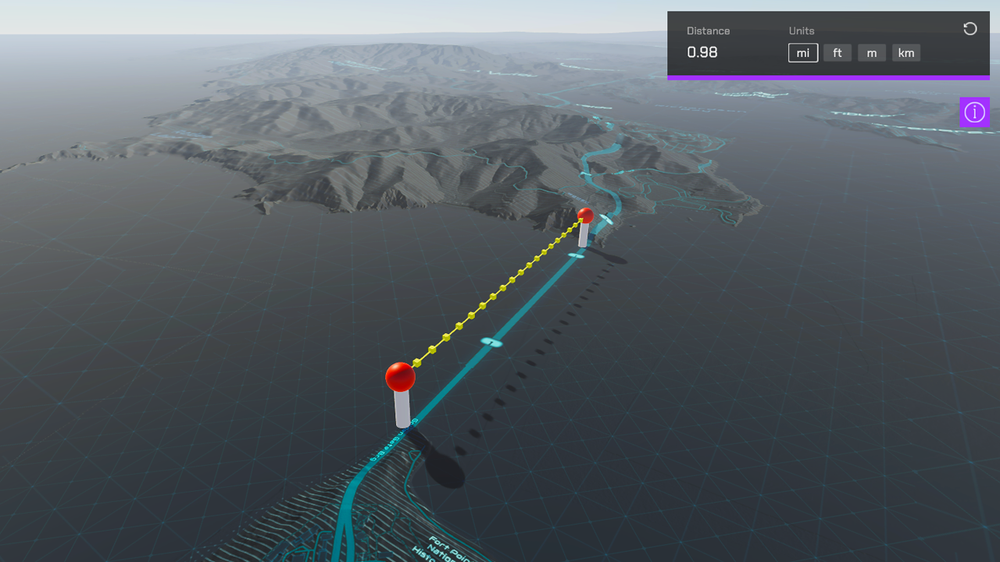

# Measure distance

Display the measured distance by drawing lines on the map.

## How to use the sample

1. Open the **Measure** scene.
2. Set your API Key in the **ArcGIS Map** game object using the **Inspector** window.
3. While holding shift, click on the map to begin measuring. Continue to click on the map to add additional vertices. The accumulated distance will be shown. This sample is only set up to work with a mouse and keyboard.

## How it works

1. This sample uses [`ArcGISGeometryEngine`](https://developers.arcgis.com/unity/api-reference/gameengine/geometry/arcgisgeometryengine#distancegeodetic) to calculate distance. 
2. The measured distance is [geodetic/geodesic distance](https://developers.arcgis.com/documentation/glossary/geodetic-measurement/). Geodetic distance is calculated in a 3D spherical space as the distance across the curved surface of the world. You can find more information about the differences between geodesic and planar distance in the [ArcGIS Pro documentation](https://pro.arcgis.com/en/pro-app/2.8/tool-reference/spatial-analyst/geodesic-versus-planar-distance.htm).
3. Interpolation points are optional and are used to align line segments to terrain. 

## Tags

measure, geometry, analysis
