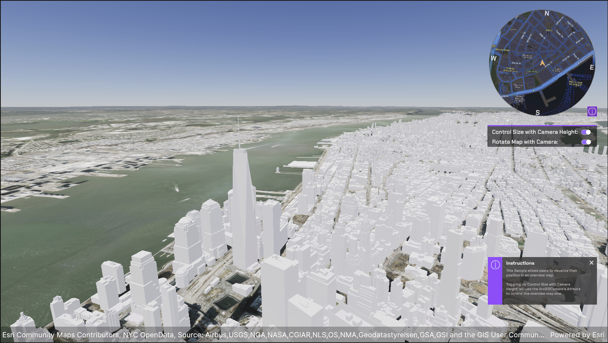

# Visualize your position in an Overview Map

## How to use the sample (SampleViewer)

1. The SampleViewer Scene should open by default. If it is not open, click the **SampleViewer** scene to open it.
2. Click play.
3. Using the UI, enter an APIKey in the input field to the top left. 
4. Open the **Samples** drop down, and click **Overviw Map** to open the level.
5. Use the W,A,S,D keys to move and right click and drag on the Game viewport to look around.

## How to use the sample (HitTest Scene)

1. Open the **Overviw Map** scene.
2. Click on the **ArcGISMap** GameObject and set your API key in the **Inspector** window. 
3. Click play.
4. Use the W,A,S,D keys to move and right click and drag on the Game viewport to look around.

## How it works

1. Create an ArcGIS Map and name it "ArcGIS Overview".
2. Attach an [**ArcGIS Camera**](https://developers.arcgis.com/unity/maps/camera/#arcgis-camera) component to the active camera and set the rotation on the **ArcGISLocation Component** to be (0, 0, 0). This should have it facing down. Rename it "Overview Camera".
3. Click on the **Output** drop down on the **ArcGIS Overview** and set the Target Texture to **OverviewMap Render Texture** in the Project Directory.
4. Drag the **Location Marker** prefab into the scene as a child of the ArcGIS Map.
5. Copy the ArcGIS Map you have in the scene and paste it into the scene. It should not be a child of any other game objects. Rename it to be "Main ArcGIS Map".
6. Change the altitude of the **Main ArcGIS Map** to be -1000. This will position it above the **ArcGIS Overview** map.
7. Remove the **Location Marker** from the **Main ArcGIS Map**.
8. Click on the **Overview Camera** under **Main ArcGIS Map** and rename it to "ArcGIS Camera". Change the rotaiton to be facing forward.
9. Right click in the Hierarchy and create a new **Raw Image**. Set the output of the raw image to the **OverviewMap Render Texture**.
10. Click play and move around the screen. Observe the **Overview Map** update as you move the camera around and rotate the heading of the camera controller.

## About the data

Building models for New York are loaded from a [3D object scene layer](https://tiles.arcgis.com/tiles/z2tnIkrLQ2BRzr6P/arcgis/rest/services/New_York_LoD2_3D_Buildings/SceneServer/layers/0) hosted by Esri.

Elevation data is loaded from the [Terrain 3D elevation layer](https://www.arcgis.com/home/item.html?id=7029fb60158543ad845c7e1527af11e4) hosted by Esri.

## Tags

OverviewMap
