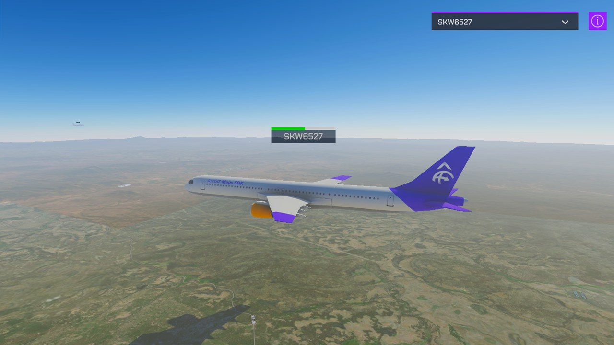

# Subscribe to a stream service

Subscribe to the stream service's WebSocket and receive information through to update information in real-time.



## How to use the sample

This sample shows planes on current locations together with the flight number and flight time status bar.

1. Open the **StreamLayer** scene.
2. Set your API Key in the **ArcGIS Map** game object using the **Inspector** window.
3. After clicking play, select a flight number from the drop-down list to find the plane on the map.

The camera moves to the plane position and you see the flight number and flight time status bar on top of the plane model.

## How it works

### Getting the data

This sample subscribes to a [stream service](https://enterprise.arcgis.com/en/geoevent/latest/disseminate-and-notify/stream-services.htm) on [ArcGIS GeoEvent Server](https://enterprise.arcgis.com/en/geoevent/latest/get-started/what-is-arcgis-geoevent-server.htm) using a WebSocket to receive data. 

Client applications will need to construct a subscription request that includes the WebSocket URL. The format of the request is illustrated below; make sure to include `subscribe` in the request:

```text
wss://geoeventsample1.esri.com:6143/arcgis/ws/services/FAAStream/StreamServer/subscribe
```

In this sample, the ArcGIS GeoEvent Server returns information from flights over the United States, including location and flight number, to update game objects in real-time.

The service of this sample uses mocked information so it is not accurate in real-time although the workflow is the same for using a service with real-time information.

### Making the connection

To make the connection, this sample uses [`ClientWebSocket`](https://learn.microsoft.com/dotnet/api/system.net.websockets.clientwebsocket) class to connect to a WebSocket server as an asynchronous operation. It opens the connection with the WebSocket URL and processes the result while the connection remains open.

### Parsing the response

Every time the stream server has an update for a new plane or an existing one, it is necessary to parse the JSON response to update the information on the map. Apply the Unity's [`[Serializable]`](https://docs.unity3d.com/2022.3/Documentation/ScriptReference/Serializable.html) attribute to classes to enable serialization and parse the JSON response.

We grab the location (`x`, `y`, `z`), speed (`speed`), heading (`heading`), time the update was sent (`dateTimeStamp`), and the plane name (`name`). All of this information is used to display the plane in the correct location as well as inputs for a [dead reckoning](https://en.wikipedia.org/wiki/Dead_reckoning) system (`DeadReckoning.cs`) that updates each plane's location every frame so that the plane has a smooth animation instead of jumping from place to place every time we receive a new signal.

These new game objects are then used to populate the drop-down list, allowing you to quickly navigate to other planes by updating the `ArcGIS Camera` location. When flying around the scene, you may encounter another plane—especially if you are near a large airport.

## About the data

This sample uses the [plane location stream service](https://geoeventsample1.esri.com:6443/arcgis/rest/services/FAAStream/StreamServer) sample. This data was recorded in the past and played back in real-time. It is not a live update of the current air traffic. 

To publish your own streams of data, please refer to the [ArcGIS GeoEvent Server](https://enterprise.arcgis.com/en/geoevent/latest/get-started/what-is-arcgis-geoevent-server.htm) documentation.

## Tags

steam, stream layer, stream service, websocket, planes
