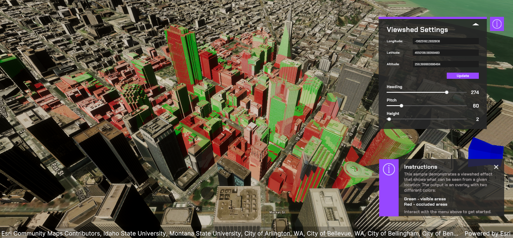
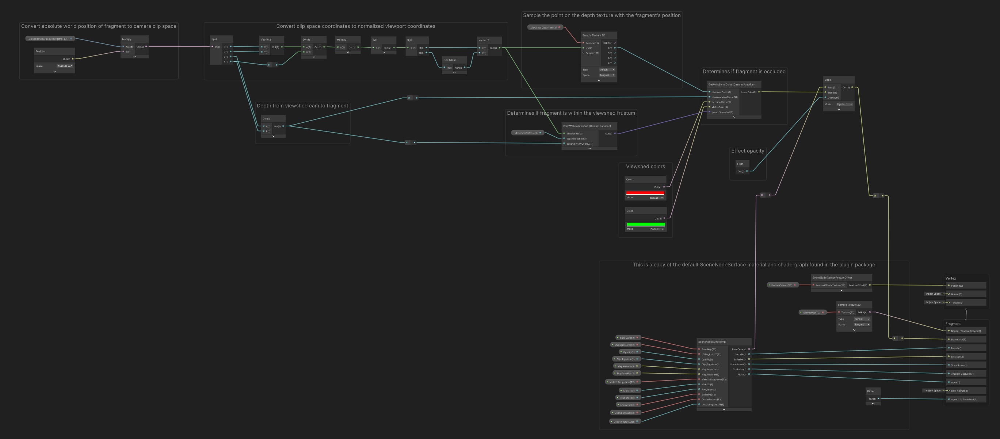

# Explore an interactive viewshed visualization

## How to use the sample

1. Open the scene.
2. Click on the **ArcGISMap** GameObject and set your API key in the **Inspector** window.
3. Click play.

## How it works

This interactive viewshed effect sample visualizes the areas of a terrain that are visible from a specific viewpoint.

The core of the sample is the `ViewshedCamera` script, which sets up an observer camera and creates a depth texture to capture the terrain's depth information. This script also updates global shader properties with the camera's view-projection matrix and far clip plane, which are essential for the custom shader to determine visibility.

The custom shader is designed to color the terrain based on visibility, with visible areas highlighted in green and invisible areas in red. By using the depth texture generated by the observer camera, the shader can accurately determine which areas are visible.

`ViewshedMap.cs` initializes the map, sets the basemap and elevation sources, and adds a 3D object scene layer with a custom material for the viewshed visualization. It ensures that the map and its layers are properly configured and displayed in the scene.

Together, these components create an interactive and dynamic viewshed visualization, allowing you to explore and understand the visibility of different areas of the terrain from a specific viewpoint.

## About the data

The test scene uses the San Francisco 3D Object Scene Layer available from the plugin samples.

## Notes

- Currently, only 3D Object Scene Layers are supported by the API call to `layer.MaterialReference()`, which sets a custom material to those layer types. We plan to add a call to apply a custom material to tiled layer and integrated mesh layers in a future release.
- Due to floating point precision issues, there might be some minor artifacts in small, detailed areas. You can adjust the depth texture size in the `ViewshedCamera` component at an extra computation cost.
- Objects that are behind the main ArcGIS or Scene camera will be unloaded and culled for unrelated performance reasons. This is expected behaviour and might result in the Viewshed Camera marking an area as visible until the occluded objects are loaded and rendered again.

## Tags

viewshed
