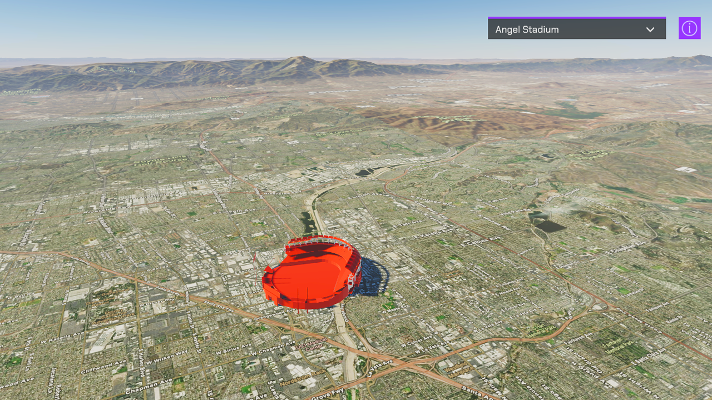

# Query a feature layer

Query objects from a feature layer and show it on the map.

## How to use the sample

1. Open the **FeatureLayer** scene.
2. Click on the **ArcGISMap** game object in the **Hierarchy** window.
3. Set your API key in the **Inspector** window.
4. Click play and select a stadium from the lst.

## How it works

### Getting the data

In this sample, the [FeatureService REST API](https://developers.arcgis.com/rest/services-reference/enterprise/layer-feature-service-.htm) is used to perform a query operation. The result of a query operation is a list of features that includes the feature's location as well as some attributes giving more details about the feature. In this sample, the stadium name and team name were used.
The `FeatureLayerQuery.cs` file makes the request and then parses the result to construct the game objects based on the results. The **ArcGIS Location** component can be attached to these new game objects in order to locate them in the world. Use the `StadiumInfo.cs` script to store information specific to the feature, such as the team name, stadium name, the team's division in the MLB. The team's league is used to determine how the stadium is rendered in the game.

### Making the request

To make the request we append `/Query` onto the end of the Feature layer we want to get data from. Additional request headers are used to control what content we get back. You can learn all about the Query REST API [here](https://developers.arcgis.com/rest/services-reference/enterprise/query-feature-service-layer-.htm). In this example we use a few of them: `f=geojson` to control the output format of the response; `where=1=1` to get all the features back, in some cases especially datasets with a large amount of features using an intelligent where clause can ensure you only request the data that you need; `outSR=4326` makes it so that the geometries in the response are in the WGS84 spatial reference, make sure you parse the geometry in this spatial reference; and finally `outFields=LEAGUE,TEAM,NAME` this tells the service which attributes to return. The `outFields` are unique from feature layer to feature layer so make sure you know your data and what fields you want to get in the response.

### Parsing the response

After the request succeeds we will parse the text and turn it into meaningful `GameObjects`. Parsing the response can be a bit tedious because there is lots of string parsing to ensure you get the data you need. `CreateGameObjectsFromResponse(string Response)` in `FeatureLayerQuery.cs` shows an example of how this can be accomplished which will differ depending on the request headers you sent. A new `GameObject` is created for each feature and an `ArcGISLocation` component is attached with the values modified to be the feature's location. In this sample, a `StadiumInfo` component is also attached to the new game object to hold information about the stadium and control the color it is rendered.

### Adjusting the game object's altitude

Feature layers sometimes only hold the feature's X/Y position but not the Altitude. Because of this, this sample has some added complexity to show you how to place the object on the ground. There are two recommended ways to get the elevation at a given point.

1. Use the [elevation's REST API](https://developers.arcgis.com/rest/services-reference/enterprise/image-service.htm) to query or identify a point and get the elevation value.
2. Use the game engine's [raycast](https://docs.unity3d.com/ScriptReference/Physics.Raycast.html) feature from a point above the surface towards the ground to detect the altitude dynamically.

This sample uses option 2. A caveat of using option 2 is that the raycast will only hit the surface if the point we are trying to hit is being loaded. The ArcGIS Maps SDK for game engine's dynamically stream content based on what the camera is seeing. To account for this `StadiumInfo.cs` only casts a ray for a stadium when it is within the `RayCastDistanceThreshold` which defaults to 30 km. To keep the CPU from getting overloaded, we stop adjusting the object's altitude after the raycast hits the ground. The way we use raycast in this sample is just one way of accomplishing this task. Feel free to experiment to find a way that works best for your use case.

### Navigating the scene

These new game objects are then used to populate the drop-down list allowing you to quickly navigate to other stadiums by updating the `ArcGIS Camera` location. When flying around the scene you will see stadiums if you know where to look or floating high above in the sky there are capsules to show you where each stadium is.

## About the data

This sample uses the [baseball stadiums feature layer](https://services.arcgis.com/P3ePLMYs2RVChkJx/ArcGIS/rest/services/Major_League_Baseball_Stadiums/FeatureServer/0) from Esri's LivingAtlas [portal item](https://www.arcgis.com/home/item.html?id=f60004d3037e42ad93cb03b9590cafec).

The sample uses the Chengcing Lake Baseball Field [stadium model](https://www.cgtrader.com/free-3d-models/exterior/stadium/chengcing-lake-baseball-field-kaohsiung-taiwan) from tantunny under the Royalty Free License on cgtrader.

## Tags

feature, feature layer, feature service, raycast
