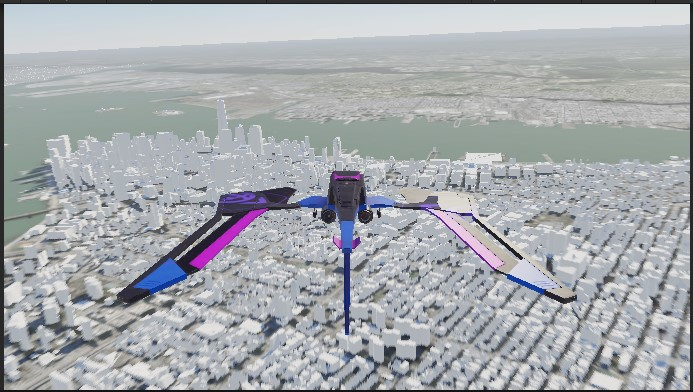

# Third Person Character Controller

Allows users to explore a city/map from the perspective of a Third Person Character.

## How it works

1. Check the box for **Mesh Colliers Enabled** on the `ArcGIS Map` component.
2. Pick an airport to take off from and set the latitude and longitude of the airport as your world center
3. Create a new blueprint and call it "bp_Runway".
4. Add a cube and change the scale of it to be 50, 2500, 1. Or something similar that suits your needs.
5. Add your Plane blueprint on top of your run way.
6. Enjoy flying around the world.

## Controls
This sample supports keyboard controls and use of an Xbox/Playstation controller
Keyboard Controls: W for Acceleration, S for Deceleration, A for Yaw Left, D for Yaw Right, K or 5 (on numberpad) for pitch Up, I or 8 (on numberpad) for pitch down, J or 4 (on numberpad) for roll left, L or 6 (on numberpad) for roll right. H can be used to toggle the landing gear.
Controller Controls: Right Trigger for Acceleration, Left Trigger for Deceleration, Left Stick Left and Right for Yaw, Right Stick Left and Right for Roll, Right Stick up and down for Pitch. Right Thumbstick button to toggle landing gear. 

## About the data

Building models for San Francisco are loaded from a [3D object scene layer](https://tiles.arcgis.com/tiles/z2tnIkrLQ2BRzr6P/arcgis/rest/services/SanFrancisco_Bldgs/SceneServer) hosted by Esri.

Elevation data is loaded from the [Terrain 3D elevation layer](https://www.arcgis.com/home/item.html?id=7029fb60158543ad845c7e1527af11e4) hosted by Esri.

## Tags

exploration, third person pespective, Flight Simulator
