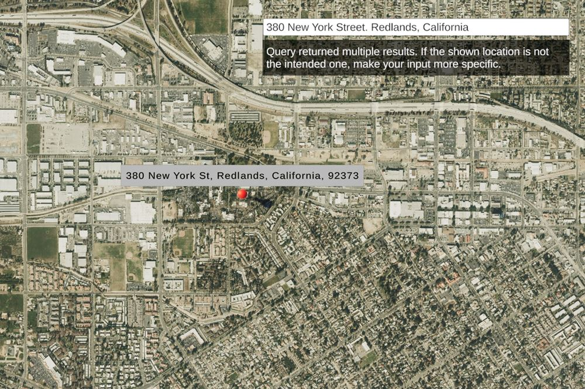

# Find places or search for an address

Find the place for an address or find the address of a selected location using the Geocoding service. 

## How to use the sample

https://developers.arcgis.com/documentation/mapping-apis-and-services/search/place-search/#how-place-search-works
Place name...

1. Open the **Geocoding** scene.
2. Click on the **ArcGISMap** game object in the **Hierarchy** window.
3. Set your API key in the **Inspector** window.
4. Click play.
5. To find a location for an address or 

## How it works

1. Set your API Key in the ArcGISMap game object using the Inspector window (if you are using the SampleViewer scene you can set the key through the SampleSwitcher game object).
2. Enter an address in the text field to get the location of the address.
3. While holding shift, left-click on a location on the map to get the address (or description) of that location.
4. Raycasts are used to determine the height at the queried location to account for elevation.
5. This sample uses Esri's [Geocoding service API](https://developers.arcgis.com/rest/geocode/api-reference/overview-world-geocoding-service.htm), which requires an API Key. You can learn more about [API keys](https://developers.arcgis.com/documentation/mapping-apis-and-services/security/api-keys/) and [Accounts](https://developers.arcgis.com/documentation/mapping-apis-and-services/deployment/accounts/) in the _Mapping APIs and location services_ guide. [Configure your API key](https://developers.arcgis.com/documentation/mapping-apis-and-services/security/tutorials/create-and-manage-an-api-key/#set-service-scopes) to support Geocoding capabilities. 

**Note:** This sample is only set up to work with mouse and keyboard.

## Tags
geocode, reverse geocode, address, locate, search
