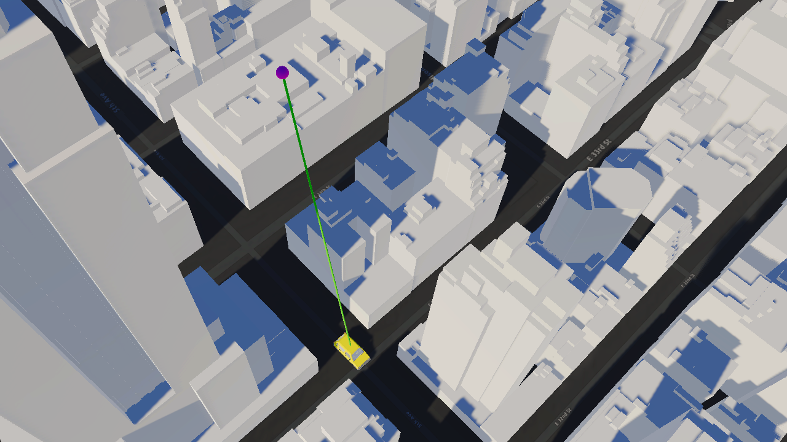

# Determine the visibility for a line of sight

Show a line of sight between two objects. Check if the line of sight is obstructed by the ArcGIS 3D object scene layer.

## How to use the sample

1. Open the **LineOfSight** scene.
2. Click on the **LineOfSightMap** game object in the **Hierarchy** window.
3. Set your API key in the **Inspector** window.
4. Click play and see the line colors changes to red if there is any object obstructing the sight.

## How it works

1. Create an ArcGIS Map with the [mesh colliders](https://developers.arcgis.com/unity/maps/mesh-collider/) enabled.
2. Attach an [**ArcGIS Camera**](https://developers.arcgis.com/unity/maps/camera/#arcgis-camera) component to the active camera.
3. Create a parent game object with the [**ArcGIS Location**](https://developers.arcgis.com/unity/maps/location-component/) component attached for other game objects to be nested under.
4. Create a child game object as the moving target object under the parent game object with the **ArcGIS Location** component attached.
5. Create a game object for the viewpoint and another for the line of sight under the game object with the **ArcGIS Location** component.
6. Create a parent game object and nest the moving object's path points in the area.
7. Attach a script to the parent game object that has the moving object's path points to update the [Transform](https://docs.unity3d.com/ScriptReference/Transform.html) of the moving object according to the path points.
8. Create a script to use [Raycast](https://docs.unity3d.com/ScriptReference/Physics.Raycast.html).
    - Use [`Physics.Raycast`](https://docs.unity3d.com/ScriptReference/Physics.Raycast.html) to check any any obstructions between the viewpoint and the moving object.
    - Use the [`RaycastHit.point`](https://docs.unity3d.com/ScriptReference/RaycastHit-point.html) property to determine where the line of sight intersects with the first object on its path.
    - If you have any objects that may interfere with the raycast check, use [`Physics.IgnoreRaycastLayer`](https://docs.unity3d.com/ScriptReference/Physics.IgnoreRaycastLayer.html).

## About the data

Building models for New York are loaded from a [3D object scene layer](https://tiles.arcgis.com/tiles/z2tnIkrLQ2BRzr6P/arcgis/rest/services/New_York_LoD2_3D_Buildings/SceneServer/layers/0) hosted by Esri.

Elevation data is loaded from the [Terrain 3D elevation layer](https://www.arcgis.com/home/item.html?id=7029fb60158543ad845c7e1527af11e4) hosted by Esri.

## Tags

line of sight, raycast, visibility, visibility analysis
