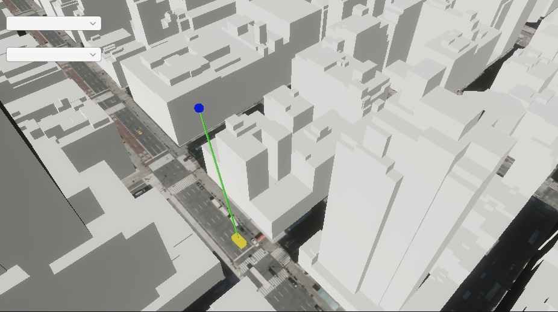

# Line of sight

Show a line of sight between two objects. Check if the line of sight is obstructed by the ArcGIS 3D object scene layer.

## How it works

1. Check the box for **Mesh Colliers Enabled** on the `ArcGIS Map View` component.
2. Create a parent object with an `ArcGIS Location` component.
3. Create child game objects in the scene that use `Transform` components.
4. Move an object around the scene so that it comes in and out of the **view** of another object.
5. Add any objects that may interfere with the raycast check to the **Ignore Raycast** layer.
6. Check for any obstructions between objects using the `Physics.Raycast` method.
7. Use the `RaycastHit.point` property to determine where the line of sight from the first object collides.

## About the data

Building models for New York are loaded from a [3D object scene layer](https://tiles.arcgis.com/tiles/z2tnIkrLQ2BRzr6P/arcgis/rest/services/New_York_LoD2_3D_Buildings/SceneServer/layers/0) hosted by Esri.

Elevation data is loaded from the [Terrain 3D elevation layer](https://www.arcgis.com/home/item.html?id=7029fb60158543ad845c7e1527af11e4) hosted by Esri.

## Tags

line of sight, raycast, visibility, visibility analysis
