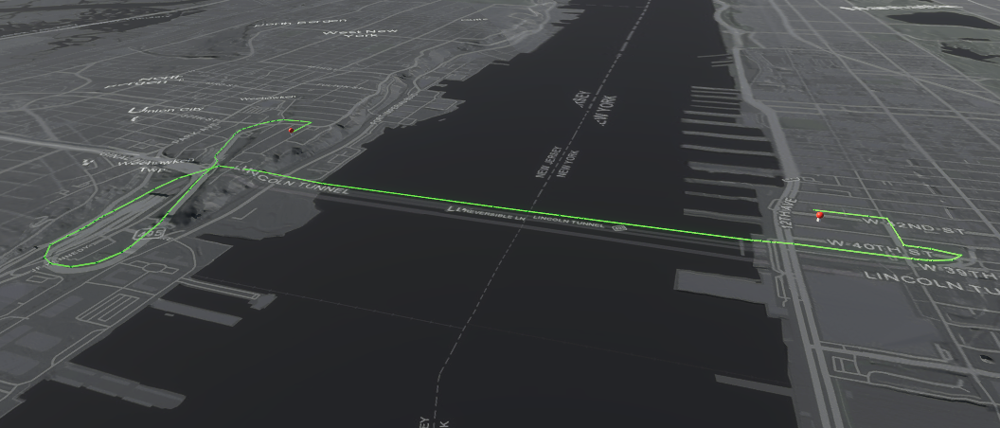

# Find a route

Show a route between two points on a map using Esri's routing service REST API.

## How to use the sample

This sample uses Esri's [routing service's REST API](https://developers.arcgis.com/rest/network/api-reference/overview-of-network-analysis-services.htm) to query the closest route along the road network between two points. This service uses routing operations associated with your API Key. You can learn more about [API keys](https://developers.arcgis.com/documentation/mapping-apis-and-services/security/api-keys/) and [Accounts](https://developers.arcgis.com/documentation/mapping-apis-and-services/deployment/accounts/) in the _Mapping APIs and location services_ guide.

1. Open the **Routing** scene.
2. Click on the **RouteManager** game object under **ArcGISMap** in the **Hierarchy** window.
3. Set your API key in the **Inspector** window.
4. Click play and left click on the map twice while holding shift. (This sample is only set up to work with mouse and keyboard.)

## How it works

1. The `HTTPClient` is used to query the [routing service's REST API](https://developers.arcgis.com/rest/network/api-reference/overview-of-network-analysis-services.htm). 
2. The sample makes a [direct request](https://developers.arcgis.com/rest/network/api-reference/route-synchronous-service.htm) to obtain the routing result.
3. The [Raycast](https://docs.unity3d.com/ScriptReference/Physics.Raycast.html) is used to determine the elevation at each breadcrumb's position to account for elevation. (Mesh colliders need to be enabled in the **ArcGIS Map** component to use the Raycast.)
4. Unity's [Line Renderer component](https://docs.unity3d.com/Manual/class-LineRenderer.html) is used to visualize the route segments between pairs of breadcrumbs.

## Tags

routing, raycast, REST API
