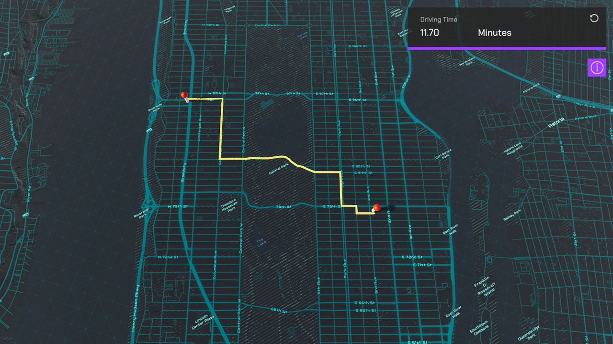

# Routing

Show a route between two points on a map using Esri's routing service REST API.

## How it works

1. Set your API Key in the RouteManager inspector window.
2. While holding shift, left click on the map twice. The route will be shown between the two points. This sample is only setup to work with mouse and keyboard.
3. This sample uses Esri's [routing service's REST API](https://developers.arcgis.com/rest/network/api-reference/overview-of-network-analysis-services.htm) to query the closest route along the road network between two points. This service uses routing operations associated with your API Key. You can learn more about [API keys](https://developers.arcgis.com/documentation/mapping-apis-and-services/security/api-keys/) and [Accounts](xref://site.documentation/accounts/) in the _Mapping APIs and location services_ guide.
4. Raycasts are used to determine the elevation at each breadcrumb's position to account for elevation.

## Tags

routing, raycast, REST API
