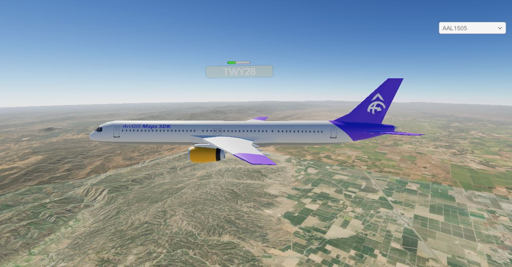

# Connect to a Stream Layer

Poll information thru a web socket on a stream layer to update information in real time.

## How it works

### Getting the data

In this sample a websocket is used to subscribe to a Stream Server. This Stream Server returns information from flights over the United States including location and flight callsign to update Game Objects in real time. This service `ws://geoeventsample1.esri.com:6180/arcgis/ws/services/FAAStream/StreamServer/subscribe` in the sample is actually mocked information so it is not accurate in real time but using a service with real time information the workflow would be the same. 

### Making the connection

To make the connection we just use Unity's `ClientWebSocket` class. We open the connection with the desired URL and while the connection remains open we process the result.

### Parsing the response

Every time the StreamServer has an update for a new plane or an existing one we are showing we need to parse the JSON response. `[System.Serializable]` classes are made to leverage Unity's built in JSON parsing. We grab the location, speed, heading, time the update was sent and the plane name. All of this information is used to display the plane in the correct location as well as inputs for a `DeadReckoning` system that updates each planes location every frame so that the plane has a smooth animation instead of jumping from place to place every time we receive a new signal.

### How to Use

These new game objects are then used to populate the drop-down list allowing you to quickly navigate to other planes by updating the `ArcGIS Camera` location. When flying around the scene you may encounter a plane especially if you are near a large airport.

## About the data

This sample uses the [geoevent stream server plane location stream layer](ws://geoeventsample1.esri.com:6180/arcgis/ws/services/FAAStream/StreamServer/subscribe). This data was recorded in the past and played back in real time. It is not a live update of current air traffic. 

## Tags

steam, stream layer, stream service, websocket, planes
