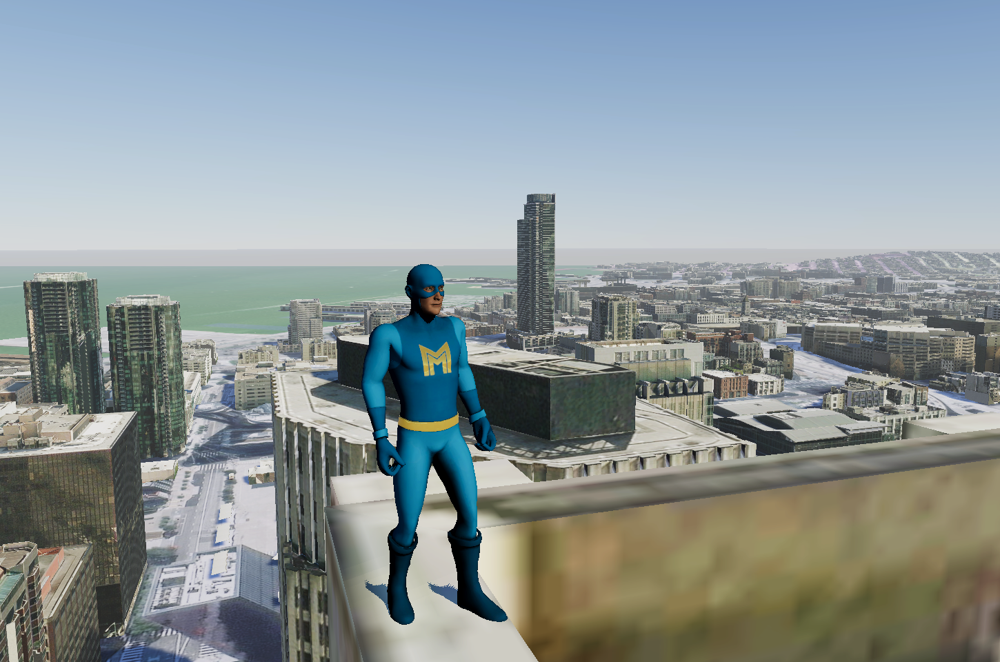

# Explore with a Third Person Controller

Explore from the perspective of a third person camera following a controllable character.

## How to use the sample

1. Open the **ThirdPerson** level.
2. Click on **ArcGISMap** 
3. Set your API key under the **Authentication** section.
4. Click play and move the character by using the WASD keys. Jump with the space key.

## How it works

This samples makes use of Unity's [Starter Assets - Third Person Character Controller](https://assetstore.unity.com/packages/essentials/starter-assets-third-person-character-controller-196526).

1. Set up the **ArcGIS Map** for the exploration area.
2. Create a Third Person Character with its control and attach to **ArcGIS Map**. 
3. Add the Third Person Character to the level.
   - Mesh colliders need to be enabled in the **ArcGIS Map**.
   - If you want to place the character on a specific location, attach the [**ArcGIS Location Component**](https://developers.arcgis.com/unreal-engine/maps/location-component/) to specify it.
   - The Third Person Character provided in this sample detects the terrain mesh collider before it lands on the ground. 

## About the data

Building models for San Francisco are loaded from a [3D object scene layer](https://tiles.arcgis.com/tiles/z2tnIkrLQ2BRzr6P/arcgis/rest/services/SanFrancisco_Bldgs/SceneServer) hosted by Esri.

Elevation data is loaded from the [Terrain 3D elevation layer](https://www.arcgis.com/home/item.html?id=7029fb60158543ad845c7e1527af11e4) hosted by Esri.

## Tags

3rd person, camera, controller, exploration, follow, platformer, third person perspective, third person controller
