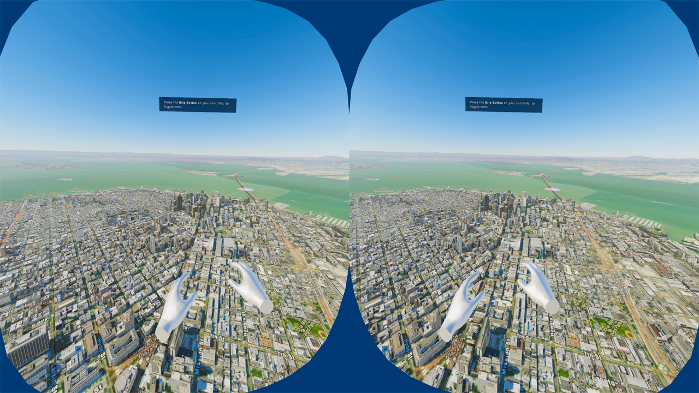

# Virtual Reality Simulation

Move around an ArcGIS World using Virtual Reality to move and fly through different cities

## How it works

1. Check the box for **Mesh Colliers Enabled** on the `ArcGIS Map View` component if you want the camera to be able interact with buildings and the ground. This will have a negative impact on performance so you may want to disable this on less powerful devices.
2. Drag and Drop the VR Origin Prefab into the scene.
3. Drag and drop the XR Interaction Manager Prefab into the scene.
4. Draga an drop the Locomotion System Prefab into the scene.
5. Parent the XR Origin prefab to the ArcGISMap game object.
6. Expand the XR Origin fully and select the Main Camera Game Object.
7. In the Inspector, click add component and search "ArcGIS Camera Component" and add it to the Main Camera Game Object.
8. Press play and enjoy exploring.

## How to Use
This sample runs off of the OpenXR framework and supports the following headsets/devices:
1. Oculus Rift S
2. Oculus Rift
3. Oculus Quest
4. Oculus Quest 2
5. HTC Vive
6. HTC Vive Pro
6. HTC Vive Cosmos
7. Valve Index

In order to use this sample, connect your headset to your computer and ensure it is detected properly. Upon loading the sample, place the headset on your head. It should automatically use the headset to control the cameras height and rotation as well as position in the world. To move, use the joystick on the right controller, pushing the joystick will move you in that direction. The joystick on the left controller can be used to 'snap turn' 45 degrees, making it so you can turn around quickly.

## About the data

Building models for San Fransisco are loaded from a [3D object scene layer](https://tiles.arcgis.com/tiles/z2tnIkrLQ2BRzr6P/arcgis/rest/services/SanFrancisco_Bldgs/SceneServer) hosted by Esri.

Elevation data is loaded from the [Terrain 3D elevation layer](https://www.arcgis.com/home/item.html?id=7029fb60158543ad845c7e1527af11e4) hosted by Esri.

## Tags

Exploration, First Person, Virtual Reality
