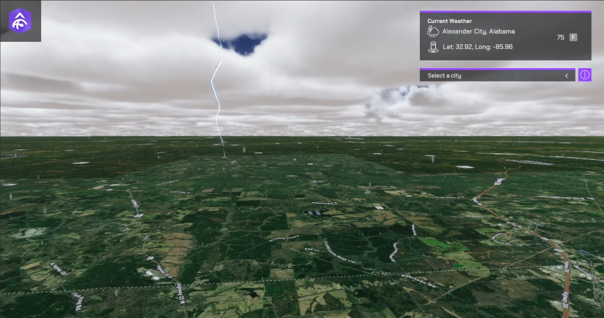

# Query Current Weather Conditions Across the U.S.A

Query Weather Data from the Weather Stations feature layer provided in order to display weather conditions on the map.

## How to Setup (Weather Sample Level)

1. Open the **RealTimeWeather** level.
2. Click on the **ArcGISMap** in the Hierarchy panel.
3. Set your API key under the Authentication section in the Inspector Window.
4. Click Play and select a city from the list.

## How to Setup (Sample Viewer)

1. Click Play in Unity Editor.
2. Input your API key under the **API Key Drop-down**.
3. Click the **Sample Drop-Down** and select **Weather Query**.

## How it works

1. Create a new C# script and make a http request to [query a feature layer](https://developers.arcgis.com/rest/services-reference/enterprise/query-feature-service-.htm). 
2. Create a new C# script
   - Create the function to place the data returned from the Weather Query.
   - Create a function to spawn the weather data class according to the data received in the query.
   - Attach the [**ArcGIS Location Component**](https://developers.arcgis.com/unreal-engine/maps/location-component/) to the weather weather data Game Object.
   - Add aditional functionality to spawn/show different **Unity VFX** based on the current weather data returned from the **Weather Query**.
3. Create a UI for the viewport so users can select a city from the list fed from the feature service.

Note: You can use `Unity Console` to print log messages in the **Console** window and see if you are gathering the data properly from the feature service.

## About the data

Data for Current Weather in the United States is fetched from a [Feature Layer](https://services9.arcgis.com/RHVPKKiFTONKtxq3/ArcGIS/rest/services/NOAA_METAR_current_wind_speed_direction_v1/FeatureServer/0) hosted by Esri.
Elevation data is loaded from the [Terrain 3D elevation layer](https://www.arcgis.com/home/item.html?id=7029fb60158543ad845c7e1527af11e4) hosted by Esri.

## Tags

Feature Layer, Data Collection