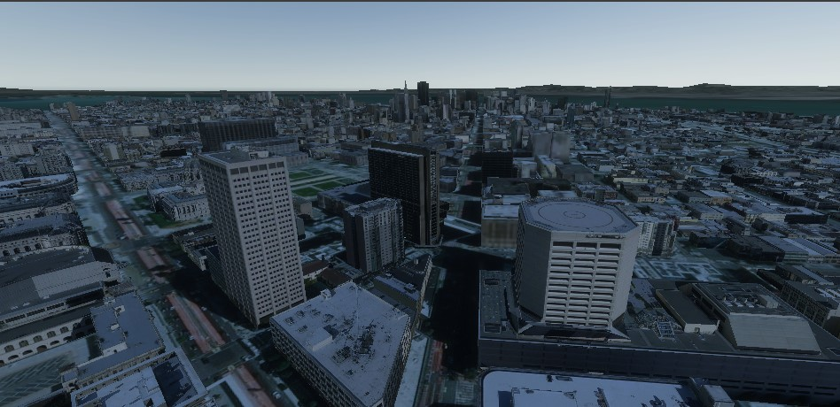

# Simulate ArcGISMaps in Virtual Reality

Move around an ArcGIS World using Virtual Reality to move and fly through different cities

## How to use the sample

This sample runs off of the OpenXR framework and supports the following headsets/devices:
- Meta Rift S
- Meta Rift
- Meta Quest
- Meta Quest 2
- HTC Vive
- HTC Vive Pro
- HTC Vive Cosmos
- Valve Index

### Deployment

For deploying, please refer to this [document](https://developers.arcgis.com/unity/deployment/)
In order for the sample to run on Meta Headsets, the device must be placed in **Developer Mode**. Please refer to this [document](https://developer.Meta.com/documentation/native/android/mobile-device-setup/) for how to perform such an action. This must be done for running the sample in the Unity Engine, making a build to run on Windows, or making a build directly to the headset (Meta Quest, Meta Quest 2, and Meta Quest Pro)

1. Ensure your headset is properly connected to your computer. For Meta Headsets, make sure the Meta Desktop App is open and your headset says **connected** in the **devices** section. For Steam VR headsets, ensure Steam is open and Steam VR is running. 
2. Place the headset on your head. The sample should automatically use the headset to control the camera's position and rotation in the world. 
3. To move, use the joystick on the left controller, pushing the joystick will move you in that direction. The joystick on the right controller can be used to 'snap turn' 45 degrees, making it so you can turn around quickly. Additionally, pushing the right joystick up or down will allow the player to fly up or down in the world. 

Please ensure that the project is using URP if you are using any of the Meta Headsets listed above. HDRP may be used for any of the other headsets, but not Meta. It will cause errors in the project. 

## How it works

This sample provides three Prefabs for users to add to any scene making setup easy! 
- XR Origin: This Prefab holds all the components for tracking the VR headset and controllers, as well as the camera that renders components in the scene. 
- XR Interaction Manager: This Prefab receives the input from the headset and controllers and allows the user to move their hands using the controllers as well as to control the rotation by moving their head with the headset on. Without this Prefab in the scene, the sample **will not work**. 
- Locomotion System: This Prefab controls the movement in the sample, such as walking and flying around. 

1. Create a map and check the box for **Mesh Colliers Enabled** on the **ArcGIS Map** component if you want the camera to be able to interact with buildings and the ground. This will have a negative impact on performance so you may want to disable this on less powerful devices.
2. Drag and Drop the **XR Origin** Prefab into the scene.
3. Drag and drop the **XR Interaction Manager** Prefab into the scene.
4. Drag and drop the **Locomotion System** Prefab into the scene.
5. Parent the **XR Origin** Prefab to the game object that has the **ArcGISMap** component on it.
6. Expand the **XR Origin** game object fully and select the Main Camera game object.
7. In the **Inspector** window, click on **Add Component** and search "ArcGIS Camera" component and add it to the Main Camera game object.

## About the data

Building models for San Fransisco are loaded from a [3D object scene layer](https://tiles.arcgis.com/tiles/z2tnIkrLQ2BRzr6P/arcgis/rest/services/SanFrancisco_Bldgs/SceneServer) hosted by Esri.

Elevation data is loaded from the [Terrain 3D elevation layer](https://www.arcgis.com/home/item.html?id=7029fb60158543ad845c7e1527af11e4) hosted by Esri.

## Tags

Exploration, First Person, Virtual Reality