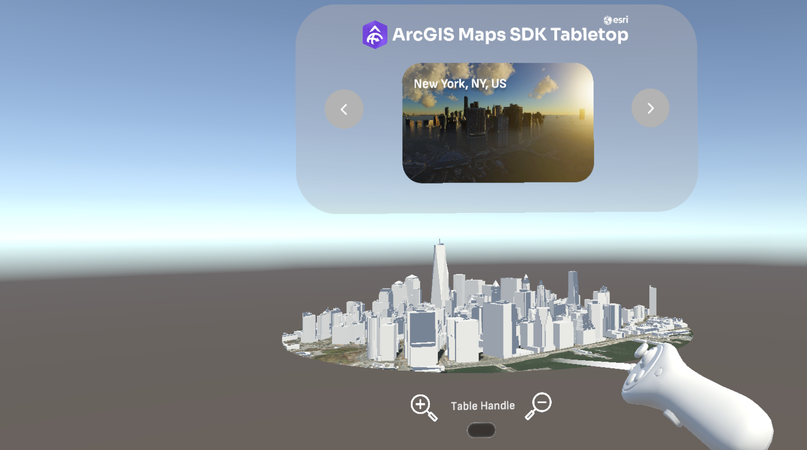

# Explore the World in Virtual Reality

Move around in an ArcGIS World using Virtual Reality to move and fly through different cities

## How to use the sample

There are two ways to use this headset, Desktop VR and Android VR. This sample utilizes the OpenXR framework and supports the following headsets/devices for **Desktop VR**:
- Meta Rift
- Meta Rift S
- Meta Quest
- Meta Quest 2
- Meta Quest Pro
- Meta Quest 3
- HTC Vive
- HTC Vive Pro
- HTC Vive Cosmos
- Valve Index

This sample utilizes the OpenXR framework and supports the following headsets/devices for **Android VR**:
- Meta Quest
- Meta Quest 2
- Meta Quest Pro
- Meta Quest 3
- HTC Vive XR Elite

**For Desktop Use**
1. Ensure your headset is properly connected to your computer. For Meta Headsets, make sure the Meta Desktop App is open and your headset says **connected** in the **devices** section. For Steam VR headsets, ensure Steam is open and Steam VR is running. 
2. Place the headset on your head. The sample should automatically use the headset to control the camera's position and rotation in the world. 
3. To move, use the joystick on the left controller, pushing the joystick (on a Quest controller) or moving on the touchpad (on a Vive controller) will move you in that direction. Move up and down by pushing the right joystick (on a Quest controller) forward and backward, or moving forward and backward on the touchpad (on a Vive controller).The right controller can also be used to 'snap turn' 45 degrees, making it so you can turn around quickly. Select the snap turn option, push the joystick left and right (on a Quest controller) or swipe left and right (on a Vive controllers) to snap turn. 
4. Use the menu button on controllers to open/close the menu, pull the left or right trigger to interact with the menu. 

**Note: AR Foundation is installed and is used to allow Passthrough on the Meta Quest Devices. If you would like to have Passthrough on other devices, please refer to the developer section for that headset**
**For Android Use**
1. Ensure your headset is in developer mode and that unknown sources are allowed on your device.
2. Ensure your headset is connected properly to your computer.
3. Navigate to File > Build Settings with in Unity.
4. Ensure that your Build Target is set to Android, if it is not please change it by selecting, switch platform after clicking on 'Android'. If you do not have the option to change it, close Unity and install the Android Build Support to your Unity Editor through Unity Hub.
5. Inside of build settings, select your headset under 'Run Device'.
6. Click 'Build and Run'.
7. Once finished, you may put your headset on and enjoy the sample.

### Deployment

For deploying, please refer to this [document](https://developers.arcgis.com/unity/deployment/)
In order for the sample to run on Meta Headsets, the device must be placed in **Developer Mode**. Please refer to this [document](https://developer.Meta.com/documentation/native/android/mobile-device-setup/) for how to perform such an action. This must be done for running the sample in the Unity Engine, making a build to run on Windows, or making a build directly to the headset (Meta Quest, Meta Quest 2, and Meta Quest Pro)

Please ensure that the project is using URP if you are using any of the Meta Headsets listed above. HDRP may be used for any of the other headsets, but not Meta. It will cause errors in the project. 

## How it works

This sample provides three Prefabs for users to add to any scene making setup easy! 
- XR Origin: This Prefab holds all the components for tracking the VR headset and controllers, as well as the camera that renders components in the scene. 
- XR Interaction Manager: This Prefab receives the input from the headset and controllers and allows the user to move their hands using the controllers as well as to control the rotation by moving their head with the headset on. Without this Prefab in the scene, the sample **will not work**. 
- Locomotion System: This Prefab controls the movement in the sample, such as walking and flying around. 

1. Create a map and check the box for **Mesh Colliers Enabled** on the **ArcGIS Map** component if you want the camera to be able to interact with buildings and the ground. This will have a negative impact on performance so you may want to disable this on less powerful devices.
2. Drag and Drop the **XR Origin** Prefab into the scene.
3. Drag and drop the **XR Interaction Manager** Prefab into the scene.
4. Drag and drop the **Locomotion System** Prefab into the scene.
5. Parent the **XR Origin** Prefab to the game object that has the **ArcGISMap** component on it.
6. Expand the **XR Origin** game object fully and select the Main Camera game object.
7. In the **Inspector** window, click on **Add Component** and search "ArcGIS Camera" component and add it to the Main Camera game object.

## Tags

Exploration, First Person, Virtual Reality