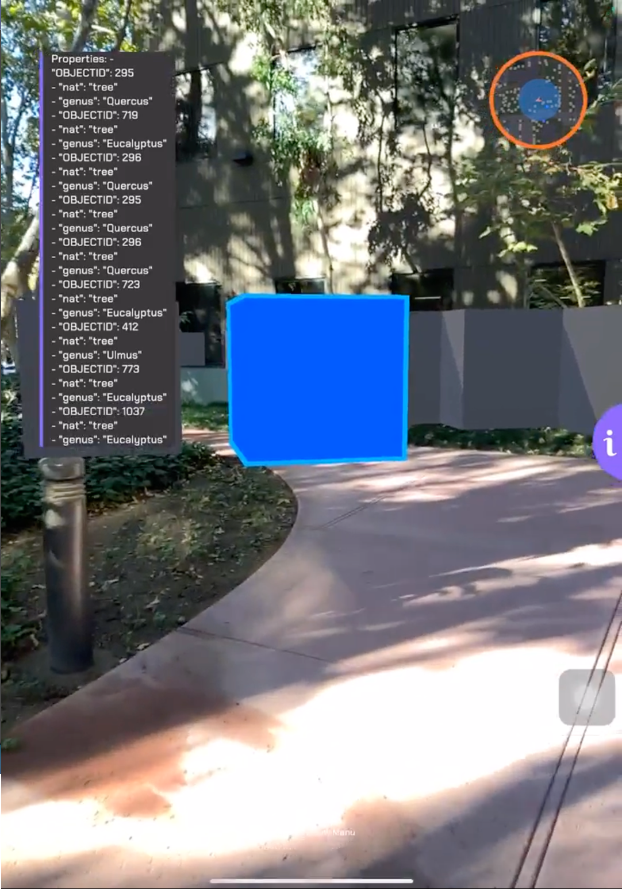

# Explore the Real-World in Augmented Reality

Move around in an ArcGIS World using Virtual Reality to move and fly through different cities

## How to use the sample

**You will need to aquire an APIKey from [Google Cloud Services](https://console.cloud.google.com/apis/dashboard?inv=1&invt=AbiiPg&project=arcgis-augmented-reality) in addition to an ArcGIS platform APIKey.**

This sample utilizes the OpenXR framework and supports the following devices:
- iOS Devices running iOS 11 or Newer
- iPadOS Devices running iOS / iPadOS 11 or Newer
- Android Devices running Android 8 or Newer

### Deployment

For deploying, please refer to this [document](https://developers.arcgis.com/unity/deployment/)
In order for the sample to run on Meta Headsets, the device must be placed in **Developer Mode**. Please refer to this [document](https://developer.android.com/studio/debug/dev-options) for how to perform such an action. This must be done for running the sample in the Unity Engine, making a build to run on Windows, or making a build directly to the headset (Meta Quest, Meta Quest 2, and Meta Quest Pro)

Please ensure that the project is using URP, HDRP is not supported on Android or iOS devices.

**Note: AR Foundation is installed and used to allow Passthrough on the mobile devices.**
**For Android Use**
1. Ensure your mobile device is in developer mode and that unknown sources are allowed on your device.
2. Ensure your mobile device is connected properly to your computer.
3. Navigate to Scene List and click the check mark next to **GeoSpatialFeatureLayer**.
3. Navigate to File > Build Settings within Unity.
4. Ensure that your Build Target is set to Android, if it is not please change it by selecting, switch platform after clicking on 'Android'. If you do not have the option to change it, close Unity and install the Android Build Support to your Unity Editor through Unity Hub.
5. Inside of the build settings, select your mobile device under 'Run Device'.
6. Click 'Build and Run'.
7. Once finished, you may put your use your mobile device and enjoy the sample.

**For iOS/iPadOS Use**
1. Ensure your mobile device is in developer mode and connected to your Apple Developer Account.
2. Ensure your mobile device is connected properly to your computer.
3. Navigate to Scene List and click the check mark next to **GeoSpatialFeatureLayer**.
4. Navigate to File > Build Settings within Unity.
5. Ensure that your Build Target is set to iOS, if it is not please change it by selecting, switch platform after clicking on 'iOS'. If you do not have the option to change it, close Unity and install the iOS Build Support to your Unity Editor through Unity Hub.
6. Inside of the build settings, select your mobile device under 'Run Device'.
7. Click 'Build and Run'.
8. Once finished, Xcode will open and begin building the application. If it fails, you will need to navigate to **Signing & Capabilities** and select your team.
9. Rebuild the application by selecting the **Play Icon** in the top left.
10. When finished building, the app will open on your device and you may enjoy the sample. 

## How it works

This sample is built using AR Core Extentions with the Geospatial Feature enabled for real world location based applications.

1. Navigate to Assets > SampleViewer > Samples > GeospatialAR and open the scene.
2. This scene has several additional scripts for controlling different behaviors in the scene. The **ArcGISGeospatialController** tracks the real world location and rotation of the users device in order to accurately position it on the ArcGISMap Component.
3. The **FeatureLayerQuery** allows users to query a feature layer and display the data in the real world.
4. The **InputController** allows users to interact with the feature layer data. Users can click on individual features in order to see what properties are attached to them. 

## Tags

Exploration, Feature Layer, Augmented Reality
