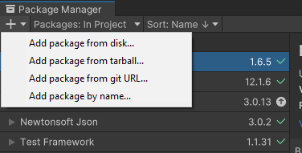

# arcgis-maps-sdk-unity-samples

Here is a Unity project containing a set of samples showing you how to accomplish various things using the combined features of Unity and the ArcGIS Maps SDK for Unity. The `main` branch is configured to work with our most recent release. If you want to use the sample repo with an older release, check out the corresponding tag of the sample repo, `git checkout 1.0.0` for the sample repo that worked with our 1.0.0 SDK release.

### Note

This repository is made up of two separate Unity projects. If you would like to see the samples made for regular use such as Feature Layer and Routing, please use and set up the **sample_project**. If you are interested in XR Samples such as the Virtual Reality Sample and the XR version of our Table Top Sample, please use and set up the **sample_xr**. Both projects may be used and set up simultaneously, but they do not contain the same samples.

### Requirements for XR Sample Project

* Computer running Windows (OpenXR is not supported on macOS)
* The Unity project requires a minimum of Unity `6000.3.0f1`
* ArcGISMaps SDK for Unity
* A VR Headset and the necessary software to run through Desktop Mode

### Supported Headsets
*indicates supported with known issues/bugs

- Meta Quest devices
- HTC Vive devices
- Valve Index
- Galaxy XR
- *Apple Vision Pro

### Setting up the Project 

1. Open xr_sample_project in Unity ignoring the errors when prompted to enter `Safe Mode`.

2. There are two options for adding the plugin to the project: 
   - Assuming you downloaded the plugin from the developer site, use the package manager to import the `.tarball` downloaded in step 2.

      

   - An alternative method to adding the plugin to the project is by using the [Unity Asset Store](https://assetstore.unity.com/packages/tools/integration/arcgis-maps-sdk-for-unity-258537). Login with your Unity account and add it to your assets. Then within Unity, go to the package manager and find it under 'My Assets' and click install.

3. There are several packages in this project that have samples that need to be imported. Please import the following:
   - ArcGIS Maps SDK Samples
   - XR interaction Toolkit Starter Assets
   - Hands Interaction Demo from XR interaction Toolkit
   - Hand Visualizer from XR Hands
   - (Optional) XR Interaction Simulator from XR interaction toolkit

4. Launch Unity and open the `SampleViewer` level (it should open by default).

5. Click on the toolbar in the top left of Unity and go to `Tools->ArcGIS Maps SDK->Project Settings` and set your API key there.

6. By default, the Meta Quest device profile is enabled under XR Interaction Settings in Project Settings. If you are using a different headset or need to make changes to feature groups enabled, you will need to do so in `Project Settings->XR-Plugin Management`.

7. (Optional) If you want to be able to open the `.cs` files in this project and have IntelliSense recognize variable correctly, in Unity navigate to `Edit -> Preferences -> External Tools -> Generate .csproj files for 'local tarball`

## Requirements

* Refer to the [ArcGIS Maps SDK for Unity's documentation on system requirements](https://developers.arcgis.com/unity/system-requirements/)

## Resources

* [ArcGIS Maps SDK for Unity's documentation](https://developers.arcgis.com/unity/)
* [Unity's documentation](https://docs.unity.com/)
* [Esri Community forum](https://community.esri.com/t5/arcgis-maps-sdks-for-unity-questions/bd-p/arcgis-maps-sdks-unity-questions)

## Issues

Find a bug or want to request a new feature?  Please let us know by submitting an issue.

## Contributing

Esri welcomes contributions from anyone and everyone. Please see our [guidelines for contributing](https://github.com/esri/contributing).

## Licensing

Copyright 2022 - 2025 Esri.

Licensed under the Apache License, Version 2.0 (the "License");
you may not use this file except in compliance with the License.
You may obtain a copy of the License at

   http://www.apache.org/licenses/LICENSE-2.0

Unless required by applicable law or agreed to in writing, software
distributed under the License is distributed on an "AS IS" BASIS,
WITHOUT WARRANTIES OR CONDITIONS OF ANY KIND, either express or implied.
See the License for the specific language governing permissions and
limitations under the License.

A copy of the license is available in the repository's [license.txt]( https://raw.github.com/Esri/arcgis-maps-sdk-unity-samples/master/license.txt) file.
